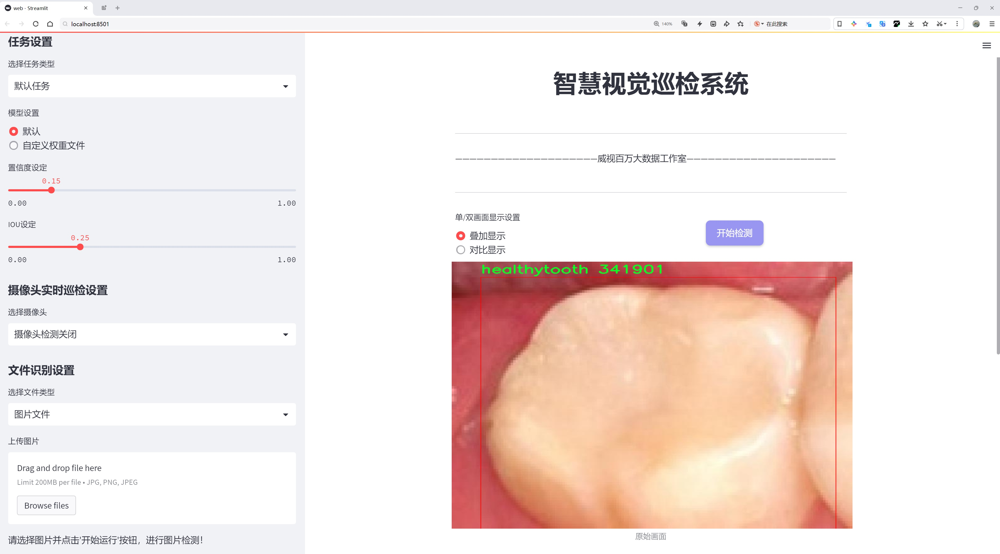
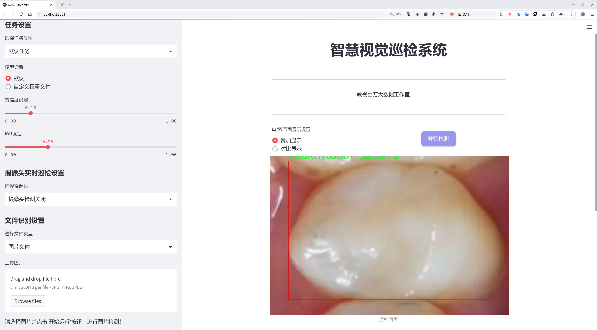
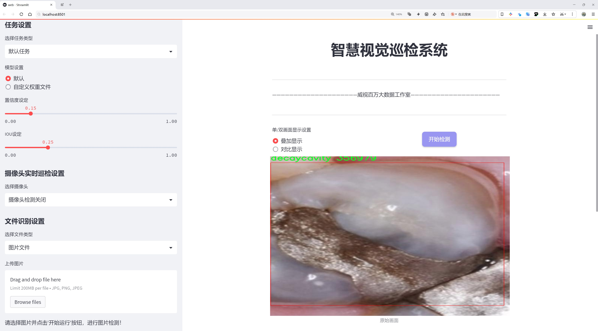
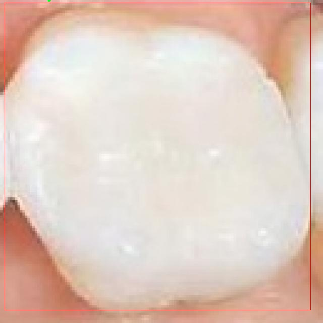
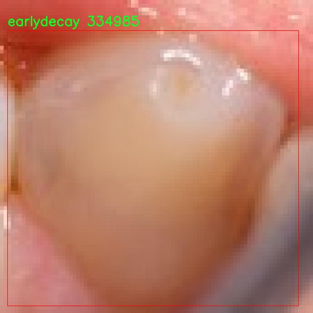
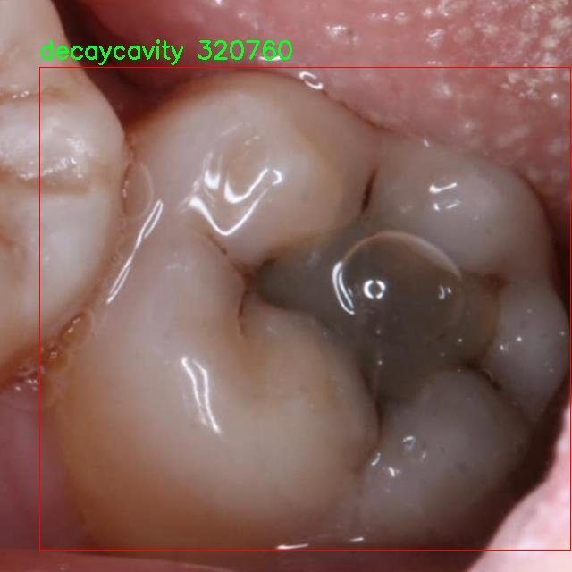
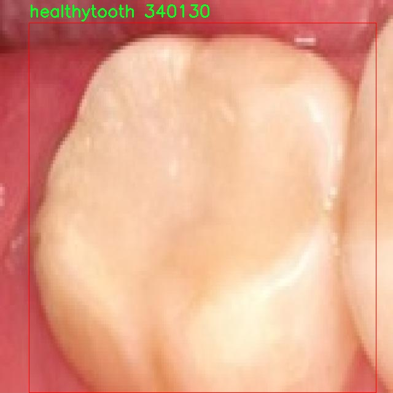

# 牙齿健康状态检测系统源码分享
 # [一条龙教学YOLOV8标注好的数据集一键训练_70+全套改进创新点发刊_Web前端展示]

### 1.研究背景与意义

项目参考[AAAI Association for the Advancement of Artificial Intelligence](https://gitee.com/qunmasj/projects)

项目来源[AACV Association for the Advancement of Computer Vision](https://kdocs.cn/l/cszuIiCKVNis)

研究背景与意义

随着现代社会对口腔健康的重视程度不断提高，牙齿健康状态的监测与评估逐渐成为口腔医学研究的重要课题。牙齿疾病，尤其是龋齿，已成为全球范围内普遍存在的健康问题，影响着人们的生活质量和身体健康。根据世界卫生组织的统计，龋齿是全球最常见的慢性疾病之一，尤其在儿童和青少年中更为显著。因此，开发一种高效、准确的牙齿健康状态检测系统，对于早期发现和预防牙齿疾病具有重要的现实意义。

近年来，计算机视觉和深度学习技术的迅猛发展为牙齿健康状态的自动检测提供了新的解决方案。YOLO（You Only Look Once）系列模型因其高效的实时目标检测能力，已广泛应用于各类视觉识别任务中。YOLOv8作为该系列的最新版本，结合了更先进的特征提取和目标检测算法，能够在保持高准确率的同时，显著提高检测速度。因此，基于改进YOLOv8的牙齿健康状态检测系统，能够为牙科医生提供快速、准确的诊断工具，帮助他们在临床实践中更好地评估患者的牙齿健康状况。

本研究将使用“Decaycavity”数据集，该数据集包含2792张图像，涵盖了三类牙齿健康状态：龋齿、早期龋齿和健康牙齿。这一数据集的构建为模型的训练和验证提供了丰富的样本，使得检测系统能够学习到不同健康状态下牙齿的特征。这不仅为牙齿疾病的早期诊断提供了数据支持，也为相关研究提供了宝贵的基础资料。通过对数据集的深入分析和模型的改进，期望能够提高系统对不同牙齿健康状态的识别精度，降低误诊率，从而为患者提供更为可靠的健康评估。

此外，基于改进YOLOv8的牙齿健康状态检测系统，具有良好的推广应用前景。随着智能医疗的不断发展，越来越多的医疗机构开始引入人工智能技术来辅助诊断。该系统的成功研发不仅能够提升牙科诊疗的效率，还能为患者提供更为便捷的健康监测手段。通过与移动设备的结合，患者可以在家中进行自我检测，及时了解自身的牙齿健康状况，从而促进早期干预和治疗。

综上所述，基于改进YOLOv8的牙齿健康状态检测系统的研究，不仅具有重要的学术价值，也具备广泛的社会应用意义。通过提高牙齿健康状态的检测效率和准确性，该系统将为口腔健康管理提供新的思路和方法，推动口腔医学的发展，为公众的口腔健康保驾护航。

### 2.图片演示







##### 注意：由于此博客编辑较早，上面“2.图片演示”和“3.视频演示”展示的系统图片或者视频可能为老版本，新版本在老版本的基础上升级如下：（实际效果以升级的新版本为准）

  （1）适配了YOLOV8的“目标检测”模型和“实例分割”模型，通过加载相应的权重（.pt）文件即可自适应加载模型。

  （2）支持“图片识别”、“视频识别”、“摄像头实时识别”三种识别模式。

  （3）支持“图片识别”、“视频识别”、“摄像头实时识别”三种识别结果保存导出，解决手动导出（容易卡顿出现爆内存）存在的问题，识别完自动保存结果并导出到tempDir中。

  （4）支持Web前端系统中的标题、背景图等自定义修改，后面提供修改教程。

  另外本项目提供训练的数据集和训练教程,暂不提供权重文件（best.pt）,需要您按照教程进行训练后实现图片演示和Web前端界面演示的效果。

### 3.视频演示

[3.1 视频演示](https://www.bilibili.com/video/BV1kG23Y4E3r/)

### 4.数据集信息展示

##### 4.1 本项目数据集详细数据（类别数＆类别名）

nc: 3
names: ['decaycavity', 'earlydecay', 'healthytooth']


##### 4.2 本项目数据集信息介绍

数据集信息展示

在现代口腔健康管理中，牙齿健康状态的准确检测与评估至关重要。为此，我们构建了一个专门用于训练改进YOLOv8的牙齿健康状态检测系统的数据集，命名为“Decaycavity”。该数据集的设计旨在提高对牙齿健康状况的自动化识别能力，进而为临床诊断提供有力支持。

“Decaycavity”数据集包含三种主要类别，分别是“decaycavity”（龋齿）、“earlydecay”（早期龋齿）和“healthytooth”（健康牙齿）。这三类标签的设置不仅涵盖了牙齿健康状态的不同阶段，还能够帮助模型在训练过程中学习到更为细致的特征，以便在实际应用中实现更高的准确率和鲁棒性。

在数据集的构建过程中，我们注重数据的多样性和代表性，确保每一类别都包含足够数量的样本，以便模型能够有效地学习到不同状态下牙齿的特征。对于“decaycavity”类别，我们收集了多种不同类型的龋齿图像，包括不同严重程度的龋齿表现，确保模型能够识别出各种形态的龋齿特征。而在“earlydecay”类别中，我们则专注于收集早期龋齿的图像，这些图像通常表现为牙齿表面的微小变色或纹理变化，具有一定的挑战性，能够有效提高模型的敏感性和精确度。最后，“healthytooth”类别则包含了多种健康牙齿的图像，确保模型能够在识别龋齿时，准确区分健康牙齿与病变牙齿。

为了增强数据集的实用性，我们在图像采集过程中采用了多种拍摄角度和光照条件，确保数据集的多样性。此外，我们还进行了数据增强处理，包括旋转、缩放、裁剪等操作，以进一步丰富数据集，提升模型的泛化能力。这些措施旨在确保训练出的YOLOv8模型在面对不同患者、不同环境时，依然能够保持高效的识别能力。

在数据集的标注过程中，我们采用了专业的口腔医生进行标注，确保每一张图像的标签都准确无误。这一过程不仅提高了数据集的质量，也为后续的模型训练提供了可靠的基础。通过高质量的标注数据，模型能够更好地学习到牙齿健康状态的关键特征，从而在实际应用中实现更高的诊断准确率。

总之，“Decaycavity”数据集的构建旨在为牙齿健康状态检测提供强有力的数据支持。通过对不同类别的细致划分和高质量的样本收集，我们期望能够显著提升YOLOv8模型在牙齿健康检测中的表现，为口腔健康管理领域的智能化发展贡献一份力量。随着数据集的不断完善和模型的持续优化，我们相信这一系统将在未来的临床应用中发挥重要作用，帮助医生更高效地进行牙齿健康评估与诊断。










### 5.全套项目环境部署视频教程（零基础手把手教学）

[5.1 环境部署教程链接（零基础手把手教学）](https://www.ixigua.com/7404473917358506534?logTag=c807d0cbc21c0ef59de5)


[5.2 安装Python虚拟环境创建和依赖库安装视频教程链接（零基础手把手教学）](https://www.ixigua.com/7404474678003106304?logTag=1f1041108cd1f708b01a)

### 6.手把手YOLOV8训练视频教程（零基础小白有手就能学会）

[6.1 手把手YOLOV8训练视频教程（零基础小白有手就能学会）](https://www.ixigua.com/7404477157818401292?logTag=d31a2dfd1983c9668658)


按照上面的训练视频教程链接加载项目提供的数据集，运行train.py即可开始训练



     Epoch   gpu_mem       box       obj       cls    labels  img_size
     1/200     20.8G   0.01576   0.01955  0.007536        22      1280: 100%|██████████| 849/849 [14:42<00:00,  1.04s/it]
               Class     Images     Labels          P          R     mAP@.5 mAP@.5:.95: 100%|██████████| 213/213 [01:14<00:00,  2.87it/s]
                 all       3395      17314      0.994      0.957      0.0957      0.0843

     Epoch   gpu_mem       box       obj       cls    labels  img_size
     2/200     20.8G   0.01578   0.01923  0.007006        22      1280: 100%|██████████| 849/849 [14:44<00:00,  1.04s/it]
               Class     Images     Labels          P          R     mAP@.5 mAP@.5:.95: 100%|██████████| 213/213 [01:12<00:00,  2.95it/s]
                 all       3395      17314      0.996      0.956      0.0957      0.0845

     Epoch   gpu_mem       box       obj       cls    labels  img_size
     3/200     20.8G   0.01561    0.0191  0.006895        27      1280: 100%|██████████| 849/849 [10:56<00:00,  1.29it/s]
               Class     Images     Labels          P          R     mAP@.5 mAP@.5:.95: 100%|███████   | 187/213 [00:52<00:00,  4.04it/s]
                 all       3395      17314      0.996      0.957      0.0957      0.0845


### 7.70+种全套YOLOV8创新点代码加载调参视频教程（一键加载写好的改进模型的配置文件）

[7.1 70+种全套YOLOV8创新点代码加载调参视频教程（一键加载写好的改进模型的配置文件）](https://www.ixigua.com/7404478314661806627?logTag=29066f8288e3f4eea3a4)

### 8.70+种全套YOLOV8创新点原理讲解（非科班也可以轻松写刊发刊，V10版本正在科研待更新）

#### 由于篇幅限制，每个创新点的具体原理讲解就不一一展开，具体见下列网址中的创新点对应子项目的技术原理博客网址【Blog】：


[8.1 70+种全套YOLOV8创新点原理讲解链接](https://gitee.com/qunmasj/good)

#### 部分改进原理讲解(完整的改进原理见上图和技术博客链接)【如果此小节的图加载失败可以通过CSDN或者Github搜索该博客的标题访问原始博客，原始博客图片显示正常】

### YOLOv8简介
YOLOv8是一种目标检测模型，是基于YOLO (You Only Look Once)系列算法发展而来的最新版本。它的核心思想是将目标检测任务转化为一个回归问题，通过单次前向传播即可直接预测出图像中的多个目标的位置和类别。
YOLOv8的网络结构采用了Darknet作为其主干网络，主要由卷积层和池化层构成。与之前的版本相比，YOLOv8在网络结构上进行了改进，引入了更多的卷积层和残差模块，以提高模型的准确性和鲁棒性。
YOLOv8采用了一种特征金字塔网络(Feature Pyramid Network,FPN)的结构，通过在不同层级上融合多尺度的特征信息，可以对不同尺度的目标进行有效的检测。此外，YOLOv8还引入了一种自适应感知域(Adaptive Anchors
的机制，通过自适应地学习目标的尺度和
长宽比，提高了模型对于不同尺度和形状目标的检测效果。
总体来说，YOLOv8结构模型综合了多个先进的目标检测技术，在保证检测速度的同时提升了检测精度和鲁棒性，被广泛应用于实时目标检测任务中。


#### yolov8网络模型结构图

YOLOv8 (You Only Look Once version 8)是一种目标检测算法，它在实时场景下可以快速准确地检测图像中的目标。
YOLOv8的网络模型结构基于Darknet框架，由一系列卷积层、池化层和全连接层组成。主要包含以下几个组件:
1.输入层:接收输入图像。
2.卷积层:使用不同尺寸的卷积核来提取图像特征。
3.残差块(Residual blocks):通过使用跳跃连接(skip connections）来解决梯度消失问题，使得网络更容易训练。
4.上采样层(Upsample layers):通过插值操作将特征图的尺寸放大，以便在不同尺度上进行目标检测。
5.池化层:用于减小特征图的尺寸，同时保留重要的特征。
6.1x1卷积层:用于降低通道数，减少网络参数量。
7.3x3卷积层:用于进—步提取和组合特征。
8.全连接层:用于最后的目标分类和定位。
YOLOv8的网络结构采用了多个不同尺度的特征图来检测不同大小的目标，从而提高了目标检测的准确性和多尺度性能。
请注意，YOLOv8网络模型结构图的具体细节可能因YOLO版本和实现方式而有所不同。


#### yolov8模型结构
YOLOv8模型是一种目标检测模型，其结构是基于YOLOv3模型进行改进的。模型结构可以分为主干网络和检测头两个部分。
主干网络是一种由Darknet-53构成的卷积神经网络。Darknet-53是一个经过多层卷积和残差连接构建起来的深度神经网络。它能够提取图像的特征信息，并将这些信息传递给检测头。
检测头是YOLOv8的关键部分，它负责在图像中定位和识别目标。检测头由一系列卷积层和全连接层组成。在每个检测头中，会生成一组锚框，并针对每个锚框预测目标的类别和位置信息。
YOLOv8模型使用了预训练的权重，其中在COCO数据集上进行了训练。这意味着该模型已经通过大规模数据集的学习，具有一定的目标检测能力。

### RT-DETR骨干网络HGNetv2简介
#### RT-DETR横空出世
前几天被百度的RT-DETR刷屏，参考该博客提出的目标检测新范式对原始DETR的网络结构进行了调整和优化，以提高计算速度和减小模型大小。这包括使用更轻量级的基础网络和调整Transformer结构。并且，摒弃了nms处理的detr结构与传统的物体检测方法相比，不仅训练是端到端的，检测也能端到端，这意味着整个网络在训练过程中一起进行优化，推理过程不需要昂贵的后处理代价，这有助于提高模型的泛化能力和性能。


当然，人们对RT-DETR之所以产生浓厚的兴趣，我觉得大概率还是对YOLO系列审美疲劳了，就算是出到了YOLO10086，我还是只想用YOLOv5和YOLOv7的框架来魔改做业务。。

#### 初识HGNet
看到RT-DETR的性能指标，发现指标最好的两个模型backbone都是用的HGNetv2，毫无疑问，和当时的picodet一样，骨干都是使用百度自家的网络。初识HGNet的时候，当时是参加了第四届百度网盘图像处理大赛，文档图像方向识别专题赛道，简单来说，就是使用分类网络对一些文档截图或者图片进行方向角度分类。


当时的方案并没有那么快定型，通常是打榜过程发现哪个网络性能好就使用哪个网络做魔改，而且木有显卡，只能蹭Ai Studio的平台，不过v100一天8小时的实验时间有点短，这也注定了大模型用不了。 

流水的模型，铁打的炼丹人，最后发现HGNet-tiny各方面指标都很符合我们的预期，后面就一直围绕它魔改。当然，比赛打榜是目的，学习才是享受过程，当时看到效果还可以，便开始折腾起了HGNet的网络架构，我们可以看到，PP-HGNet 针对 GPU 设备，对目前 GPU 友好的网络做了分析和归纳，尽可能多的使用 3x3 标准卷积（计算密度最高），PP-HGNet是由多个HG-Block组成，细节如下：


ConvBNAct是啥？简单聊一聊，就是Conv+BN+Act，CV Man应该最熟悉不过了：
```python
class ConvBNAct(TheseusLayer):
    def __init__(self,
                 in_channels,
                 out_channels,
                 kernel_size,
                 stride,
                 groups=1,
                 use_act=True):
        super().__init__()
        self.use_act = use_act
        self.conv = Conv2D(
            in_channels,
            out_channels,
            kernel_size,
            stride,
            padding=(kernel_size - 1) // 2,
            groups=groups,
            bias_attr=False)
        self.bn = BatchNorm2D(
            out_channels,
            weight_attr=ParamAttr(regularizer=L2Decay(0.0)),
            bias_attr=ParamAttr(regularizer=L2Decay(0.0)))
        if self.use_act:
            self.act = ReLU()
 
    def forward(self, x):
        x = self.conv(x)
        x = self.bn(x)
        if self.use_act:
            x = self.act(x)
        return x 
```
且标准卷积的数量随层数深度增加而增多，从而得到一个有利于 GPU 推理的骨干网络，同样速度下，精度也超越其他 CNN ，性价比也优于ViT-base模型。


另外，我们可以看到：

PP-HGNet 的第一层由channel为96的Stem模块构成，目的是为了减少参数量和计算量。PP-HGNet

Tiny的整体结构由四个HG Stage构成，而每个HG Stage主要由包含大量标准卷积的HG Block构成。

PP-HGNet的第三到第五层使用了使用了可学习的下采样层（LDS Layer），该层group为输入通道数，可达到降参降计算量的作用，且Tiny模型仅包含三个LDS Layer，并不会对GPU的利用率造成较大影响.

PP-HGNet的激活函数为Relu，常数级操作可保证该模型在硬件上的推理速度。

### 9.系统功能展示（检测对象为举例，实际内容以本项目数据集为准）

图9.1.系统支持检测结果表格显示

  图9.2.系统支持置信度和IOU阈值手动调节

  图9.3.系统支持自定义加载权重文件best.pt(需要你通过步骤5中训练获得)

  图9.4.系统支持摄像头实时识别

  图9.5.系统支持图片识别

  图9.6.系统支持视频识别

  图9.7.系统支持识别结果文件自动保存

  图9.8.系统支持Excel导出检测结果数据


### 10.原始YOLOV8算法原理

原始YOLOv8算法原理

YOLOv8（You Only Look Once version 8）作为目标检测领域的最新进展，承载着YOLO系列模型的优良传统，同时引入了一系列创新性改进，旨在提升目标检测的准确性和效率。该模型的设计理念是将目标检测任务视为一个回归问题，通过单一的神经网络结构实现对目标的快速定位和分类。YOLOv8的架构主要由输入层、主干网络、颈部网络和输出层四个核心模块构成，每个模块都在不断优化中发挥着重要作用。

在输入层，YOLOv8首先对输入图像进行预处理，以适应模型的输入要求。该过程包括Mosaic数据增强、自适应图像缩放和灰度填充等技术，旨在提高模型的泛化能力和鲁棒性。Mosaic数据增强通过将多张图像拼接在一起，生成新的训练样本，从而丰富了数据集的多样性，帮助模型更好地学习不同场景下的目标特征。

主干网络是YOLOv8的核心部分，负责从输入图像中提取特征。该部分采用了CSPDarknet（Cross Stage Partial Darknet）结构，分为两个主要分支，每个分支均包含多个残差块。这种设计不仅增强了模型的特征提取能力，还有效地减轻了梯度消失的问题。与前代模型YOLOv5相比，YOLOv8引入了C2f模块来替代C3模块，C2f模块通过将输入特征图分为两个分支，并分别经过卷积层进行降维，进一步提升了特征的表达能力。每个分支的输出通过堆叠和融合，形成更高维度的特征图，确保了模型在特征提取过程中的信息流动更加顺畅。

在特征提取的过程中，YOLOv8还采用了快速空间金字塔池化（SPPF）结构，利用多个最大池化层处理不同尺度的特征。这一设计使得模型能够在不同的尺度上捕捉到目标的特征信息，显著提升了特征抽象能力，同时有效减少了模型的参数量和计算量。这种多尺度特征提取的能力对于复杂场景下的目标检测至关重要，因为目标的大小和形状往往具有高度的多样性。

颈部网络则是YOLOv8中连接主干网络和输出层的关键部分。它采用了特征金字塔网络（FPN）和路径聚合网络（PAN）的结构，通过多层卷积和池化操作对不同尺度的特征图进行融合。这一过程不仅提升了特征图的语义信息，还增强了模型对小目标的检测能力。颈部网络的设计使得模型能够有效地整合来自不同层次的特征信息，从而在目标检测任务中实现更高的准确率。

在输出层，YOLOv8采用了解耦的检测头结构，通过两个并行的卷积分支分别计算目标的回归和分类损失。这种解耦设计使得模型在处理目标检测时能够更好地平衡分类和定位的任务，提高了整体的检测性能。具体而言，YOLOv8使用Task-Aligned Assigner方法对分类分数和回归分数进行加权，以确保正样本的匹配更加精准。同时，损失计算中采用了二元交叉熵（BCE）来计算分类损失，并结合分布焦点损失（DFL）和完全交并比（CIoU）损失函数来优化回归损失。这种多元化的损失计算方式进一步提升了模型的泛化能力和检测精度。

值得注意的是，YOLOv8在目标检测方法上采用了无锚框（Anchor-Free）的策略，这一创新使得模型在预测目标的中心点和宽高比时，能够直接进行回归，从而减少了对Anchor框的依赖。这一变化不仅提高了检测速度，还显著提升了检测的准确性，尤其是在复杂背景下的小目标检测任务中，YOLOv8展现出了优越的性能。

综上所述，YOLOv8作为目标检测领域的最新代表，通过其独特的网络结构和创新的算法设计，极大地提升了目标检测的效率和准确性。其主干网络的特征提取能力、颈部网络的特征融合策略以及输出层的解耦检测头设计，共同构成了一个高效、灵活的目标检测系统。尽管在某些复杂环境下仍然存在挑战，但YOLOv8无疑为目标检测技术的发展提供了新的思路和方向，展示了深度学习在计算机视觉领域的巨大潜力。随着研究的深入和技术的不断演进，YOLOv8及其后续版本有望在更广泛的应用场景中发挥重要作用。


### 11.项目核心源码讲解（再也不用担心看不懂代码逻辑）

#### 11.1 ui.py

以下是经过简化和注释的核心代码部分：

```python
import sys
import subprocess
from QtFusion.path import abs_path

def run_script(script_path):
    """
    使用当前 Python 环境运行指定的脚本。

    Args:
        script_path (str): 要运行的脚本路径
    """
    # 获取当前 Python 解释器的路径
    python_path = sys.executable

    # 构建运行命令，使用 streamlit 运行指定的脚本
    command = f'"{python_path}" -m streamlit run "{script_path}"'

    # 执行命令并等待其完成
    result = subprocess.run(command, shell=True)
    
    # 检查命令执行结果，如果返回码不为0，则表示出错
    if result.returncode != 0:
        print("脚本运行出错。")

# 主程序入口
if __name__ == "__main__":
    # 获取要运行的脚本的绝对路径
    script_path = abs_path("web.py")

    # 调用函数运行指定的脚本
    run_script(script_path)
```

### 代码注释说明：
1. **导入模块**：
   - `sys`：用于获取当前 Python 解释器的路径。
   - `subprocess`：用于执行外部命令。
   - `abs_path`：从 `QtFusion.path` 模块导入的函数，用于获取文件的绝对路径。

2. **`run_script` 函数**：
   - 该函数接收一个脚本路径作为参数，并使用当前 Python 环境运行该脚本。
   - `python_path` 变量存储当前 Python 解释器的路径。
   - `command` 变量构建了一个命令字符串，用于通过 `streamlit` 运行指定的脚本。
   - `subprocess.run` 函数执行命令，并等待其完成。
   - 通过检查 `result.returncode` 来判断命令是否成功执行，如果不为0，则输出错误信息。

3. **主程序入口**：
   - 在 `if __name__ == "__main__":` 块中，首先获取要运行的脚本的绝对路径，然后调用 `run_script` 函数执行该脚本。

这个文件是一个 Python 脚本，主要功能是通过当前的 Python 环境来运行一个指定的脚本，具体来说是运行一个名为 `web.py` 的脚本。首先，文件导入了几个必要的模块，包括 `sys`、`os` 和 `subprocess`，这些模块分别用于获取系统信息、处理文件路径和执行外部命令。

在 `run_script` 函数中，首先获取当前 Python 解释器的路径，这样可以确保使用正确的 Python 环境来运行脚本。接着，构建一个命令字符串，这个命令使用 `streamlit` 模块来运行指定的脚本。`streamlit` 是一个用于构建数据应用的框架，因此这个脚本的目的是启动一个基于 `streamlit` 的 Web 应用。

然后，使用 `subprocess.run` 方法来执行这个命令。这个方法会在新的 shell 中运行命令，并等待其完成。如果命令执行的返回码不为零，表示脚本运行出错，此时会打印出错误信息。

在文件的最后部分，使用 `if __name__ == "__main__":` 来确保只有在直接运行这个脚本时才会执行下面的代码。在这里，指定了要运行的脚本路径为 `web.py`，并调用 `run_script` 函数来启动这个脚本。

总的来说，这个文件的主要作用是提供一个接口，通过当前的 Python 环境来运行一个特定的 `streamlit` 脚本，方便用户启动 Web 应用。

#### 11.2 code\ultralytics\data\explorer\explorer.py

以下是代码中最核心的部分，并附上详细的中文注释：

```python
class Explorer:
    def __init__(self, data: Union[str, Path] = "coco128.yaml", model: str = "yolov8n.pt", uri: str = "~/ultralytics/explorer") -> None:
        # 初始化Explorer类，设置数据路径、模型路径和数据库连接URI
        checks.check_requirements(["lancedb>=0.4.3", "duckdb"])  # 检查所需的库是否已安装
        import lancedb  # 导入lancedb库以进行数据库操作

        self.connection = lancedb.connect(uri)  # 连接到LanceDB数据库
        self.table_name = Path(data).name.lower() + "_" + model.lower()  # 生成表名
        self.sim_idx_base_name = f"{self.table_name}_sim_idx".lower()  # 生成相似度索引表名
        self.model = YOLO(model)  # 加载YOLO模型
        self.data = data  # 数据路径
        self.choice_set = None  # 选择的数据集

        self.table = None  # 数据表
        self.progress = 0  # 进度

    def create_embeddings_table(self, force: bool = False, split: str = "train") -> None:
        """
        创建一个LanceDB表，包含数据集中图像的嵌入向量。若表已存在，则重用。
        参数:
            force (bool): 是否覆盖现有表。默认为False。
            split (str): 使用的数据集分割。默认为'train'。
        """
        if self.table is not None and not force:
            LOGGER.info("Table already exists. Reusing it. Pass force=True to overwrite it.")
            return
        if self.table_name in self.connection.table_names() and not force:
            LOGGER.info(f"Table {self.table_name} already exists. Reusing it. Pass force=True to overwrite it.")
            self.table = self.connection.open_table(self.table_name)
            self.progress = 1
            return
        if self.data is None:
            raise ValueError("Data must be provided to create embeddings table")

        data_info = check_det_dataset(self.data)  # 检查数据集信息
        if split not in data_info:
            raise ValueError(f"Split {split} is not found in the dataset. Available keys in the dataset are {list(data_info.keys())}")

        choice_set = data_info[split]  # 获取指定分割的数据集
        choice_set = choice_set if isinstance(choice_set, list) else [choice_set]
        self.choice_set = choice_set
        dataset = ExplorerDataset(img_path=choice_set, data=data_info, augment=False, cache=False, task=self.model.task)

        # 创建表的模式
        batch = dataset[0]  # 获取数据集的第一个批次
        vector_size = self.model.embed(batch["im_file"], verbose=False)[0].shape[0]  # 获取嵌入向量的维度
        table = self.connection.create_table(self.table_name, schema=get_table_schema(vector_size), mode="overwrite")  # 创建表
        table.add(
            self._yield_batches(
                dataset,
                data_info,
                self.model,
                exclude_keys=["img", "ratio_pad", "resized_shape", "ori_shape", "batch_idx"],
            )
        )  # 向表中添加数据

        self.table = table  # 保存表的引用

    def query(self, imgs: Union[str, np.ndarray, List[str], List[np.ndarray]] = None, limit: int = 25) -> Any:
        """
        查询表中相似的图像。接受单个图像或图像列表。
        参数:
            imgs (str or list): 图像路径或图像路径列表。
            limit (int): 返回结果的数量。
        返回:
            (pyarrow.Table): 包含结果的箭头表。
        """
        if self.table is None:
            raise ValueError("Table is not created. Please create the table first.")
        if isinstance(imgs, str):
            imgs = [imgs]  # 如果是单个字符串，则转换为列表
        assert isinstance(imgs, list), f"img must be a string or a list of strings. Got {type(imgs)}"
        embeds = self.model.embed(imgs)  # 获取图像的嵌入向量
        embeds = torch.mean(torch.stack(embeds), 0).cpu().numpy() if len(embeds) > 1 else embeds[0].cpu().numpy()  # 计算平均嵌入向量
        return self.table.search(embeds).limit(limit).to_arrow()  # 查询相似图像并返回结果

    def get_similar(self, img: Union[str, np.ndarray, List[str], List[np.ndarray]] = None, idx: Union[int, List[int]] = None, limit: int = 25, return_type: str = "pandas") -> Union[DataFrame, Any]:
        """
        查询表中相似的图像。接受单个图像或图像列表。
        参数:
            img (str or list): 图像路径或图像路径列表。
            idx (int or list): 表中图像的索引或索引列表。
            limit (int): 返回结果的数量。默认为25。
            return_type (str): 返回结果的类型，可以是'pandas'或'arrow'。默认为'pandas'。
        返回:
            (pandas.DataFrame): 包含结果的数据框。
        """
        assert return_type in {"pandas", "arrow"}, f"Return type should be either `pandas` or `arrow`, but got {return_type}"
        img = self._check_imgs_or_idxs(img, idx)  # 检查图像或索引
        similar = self.query(img, limit=limit)  # 查询相似图像

        if return_type == "arrow":
            return similar
        elif return_type == "pandas":
            return similar.to_pandas()  # 转换为pandas数据框并返回

    def similarity_index(self, max_dist: float = 0.2, top_k: float = None, force: bool = False) -> DataFrame:
        """
        计算表中所有图像的相似度索引。
        参数:
            max_dist (float): 考虑的最大L2距离。默认为0.2。
            top_k (float): 考虑的最近数据点的百分比。默认为None。
            force (bool): 是否覆盖现有相似度索引。默认为True。
        返回:
            (pandas.DataFrame): 包含相似度索引的数据框。
        """
        if self.table is None:
            raise ValueError("Table is not created. Please create the table first.")
        sim_idx_table_name = f"{self.sim_idx_base_name}_thres_{max_dist}_top_{top_k}".lower()  # 生成相似度索引表名
        if sim_idx_table_name in self.connection.table_names() and not force:
            LOGGER.info("Similarity matrix already exists. Reusing it. Pass force=True to overwrite it.")
            return self.connection.open_table(sim_idx_table_name).to_pandas()  # 如果表已存在，则重用

        if top_k and not (1.0 >= top_k >= 0.0):
            raise ValueError(f"top_k must be between 0.0 and 1.0. Got {top_k}")
        if max_dist < 0.0:
            raise ValueError(f"max_dist must be greater than 0. Got {max_dist}")

        top_k = int(top_k * len(self.table)) if top_k else len(self.table)  # 计算top_k
        top_k = max(top_k, 1)
        features = self.table.to_lance().to_table(columns=["vector", "im_file"]).to_pydict()  # 获取特征
        im_files = features["im_file"]
        embeddings = features["vector"]

        sim_table = self.connection.create_table(sim_idx_table_name, schema=get_sim_index_schema(), mode="overwrite")  # 创建相似度索引表

        def _yield_sim_idx():
            """生成包含相似度索引和距离的数据框。"""
            for i in tqdm(range(len(embeddings))):
                sim_idx = self.table.search(embeddings[i]).limit(top_k).to_pandas().query(f"_distance <= {max_dist}")  # 查询相似图像
                yield [
                    {
                        "idx": i,
                        "im_file": im_files[i],
                        "count": len(sim_idx),
                        "sim_im_files": sim_idx["im_file"].tolist(),
                    }
                ]

        sim_table.add(_yield_sim_idx())  # 向相似度索引表中添加数据
        self.sim_index = sim_table  # 保存相似度索引表的引用
        return sim_table.to_pandas()  # 返回相似度索引的数据框
```

以上代码是 `Explorer` 类的核心部分，包含了数据初始化、创建嵌入表、查询相似图像和计算相似度索引等功能。每个方法都附有详细的中文注释，解释了其功能和参数。

这个程序文件是一个用于图像数据集探索和查询的工具，主要是基于Ultralytics YOLO模型。它的核心功能是通过图像嵌入和相似性搜索来处理和分析图像数据集。文件中定义了两个主要的类：`ExplorerDataset`和`Explorer`。

`ExplorerDataset`类继承自`YOLODataset`，主要负责加载图像和构建数据转换。它的`load_image`方法用于从数据集中加载图像，支持从缓存或磁盘读取图像，并返回图像的原始尺寸。`build_transforms`方法则创建图像转换操作，允许在不改变图像大小的情况下进行数据增强。

`Explorer`类是该工具的核心，负责与数据库交互、创建图像嵌入表、执行查询等功能。它的构造函数接受数据集路径、模型路径和数据库URI等参数，并检查所需的依赖库是否存在。`create_embeddings_table`方法用于创建一个LanceDB表，该表存储图像的嵌入向量。如果表已经存在，可以选择覆盖它。`_yield_batches`方法生成数据批次以供嵌入计算。

查询功能是`Explorer`类的一个重要部分。`query`方法允许用户根据输入的图像查询相似图像，返回相似图像的结果。`sql_query`方法则允许用户执行SQL风格的查询，支持从表中提取特定数据。`plot_sql_query`方法可以将SQL查询的结果可视化为图像。

此外，`Explorer`类还提供了获取相似图像、绘制相似图像、计算相似性索引和绘制相似性索引的功能。`similarity_index`方法计算所有图像的相似性索引，返回与每个图像相似的图像及其距离。`plot_similarity_index`方法则将相似性索引结果以图形的形式展示。

该类还实现了一个`ask_ai`方法，允许用户通过自然语言查询图像数据集，AI会生成相应的SQL查询并返回结果。最后，`visualize`和`generate_report`方法留有待实现的功能，可能用于结果的可视化和数据集报告生成。

整体来看，这个程序文件为用户提供了一个强大的工具，用于探索和分析图像数据集，利用深度学习模型的嵌入能力进行相似性搜索和数据查询。

#### 11.3 code\ultralytics\trackers\byte_tracker.py

以下是代码中最核心的部分，并附上详细的中文注释：

```python
import numpy as np
from .basetrack import BaseTrack, TrackState
from .utils import matching
from .utils.kalman_filter import KalmanFilterXYAH

class STrack(BaseTrack):
    """
    单目标跟踪表示，使用卡尔曼滤波进行状态估计。

    该类负责存储有关单个跟踪对象的所有信息，并根据卡尔曼滤波器执行状态更新和预测。
    """

    shared_kalman = KalmanFilterXYAH()  # 共享的卡尔曼滤波器实例

    def __init__(self, tlwh, score, cls):
        """初始化新的STrack实例。"""
        super().__init__()
        # 将输入的边界框格式转换为tlwh格式并存储
        self._tlwh = np.asarray(self.tlbr_to_tlwh(tlwh[:-1]), dtype=np.float32)
        self.kalman_filter = None  # 当前跟踪对象的卡尔曼滤波器
        self.mean, self.covariance = None, None  # 状态均值和协方差
        self.is_activated = False  # 跟踪对象是否已激活的标志

        self.score = score  # 跟踪对象的置信度分数
        self.tracklet_len = 0  # 跟踪片段的长度
        self.cls = cls  # 对象的类别标签
        self.idx = tlwh[-1]  # 对象的索引

    def predict(self):
        """使用卡尔曼滤波器预测对象的下一个状态。"""
        mean_state = self.mean.copy()  # 复制当前均值状态
        if self.state != TrackState.Tracked:  # 如果状态不是跟踪状态
            mean_state[7] = 0  # 将速度设为0
        # 通过卡尔曼滤波器进行预测
        self.mean, self.covariance = self.kalman_filter.predict(mean_state, self.covariance)

    def activate(self, kalman_filter, frame_id):
        """启动新的跟踪片段。"""
        self.kalman_filter = kalman_filter  # 设置卡尔曼滤波器
        self.track_id = self.next_id()  # 获取新的跟踪ID
        # 初始化卡尔曼滤波器的状态
        self.mean, self.covariance = self.kalman_filter.initiate(self.convert_coords(self._tlwh))

        self.tracklet_len = 0  # 重置跟踪片段长度
        self.state = TrackState.Tracked  # 设置状态为跟踪
        if frame_id == 1:
            self.is_activated = True  # 如果是第一帧，则激活
        self.frame_id = frame_id  # 当前帧ID
        self.start_frame = frame_id  # 跟踪开始的帧ID

    def update(self, new_track, frame_id):
        """
        更新匹配跟踪的状态。

        参数:
            new_track (STrack): 包含更新信息的新跟踪对象。
            frame_id (int): 当前帧的ID。
        """
        self.frame_id = frame_id  # 更新当前帧ID
        self.tracklet_len += 1  # 增加跟踪片段长度

        new_tlwh = new_track.tlwh  # 获取新的边界框
        # 使用卡尔曼滤波器更新状态
        self.mean, self.covariance = self.kalman_filter.update(
            self.mean, self.covariance, self.convert_coords(new_tlwh)
        )
        self.state = TrackState.Tracked  # 设置状态为跟踪
        self.is_activated = True  # 激活跟踪

        self.score = new_track.score  # 更新置信度分数
        self.cls = new_track.cls  # 更新类别标签
        self.idx = new_track.idx  # 更新索引

    @property
    def tlwh(self):
        """获取当前边界框格式（左上角x，左上角y，宽度，高度）。"""
        if self.mean is None:
            return self._tlwh.copy()  # 如果均值为None，返回初始值
        ret = self.mean[:4].copy()  # 复制均值的前四个元素
        ret[2] *= ret[3]  # 计算宽度
        ret[:2] -= ret[2:] / 2  # 计算左上角坐标
        return ret

    @staticmethod
    def tlwh_to_xyah(tlwh):
        """将边界框转换为格式（中心x，中心y，宽高比，高度）。"""
        ret = np.asarray(tlwh).copy()  # 复制输入
        ret[:2] += ret[2:] / 2  # 计算中心坐标
        ret[2] /= ret[3]  # 计算宽高比
        return ret
```

### 代码核心部分解释：
1. **STrack类**：负责单个对象的跟踪，使用卡尔曼滤波器进行状态预测和更新。
2. **共享卡尔曼滤波器**：所有STrack实例共享一个卡尔曼滤波器，以提高效率。
3. **初始化**：构造函数接收边界框、置信度分数和类别，并初始化跟踪状态。
4. **预测**：使用卡尔曼滤波器预测下一个状态。
5. **激活和更新**：管理跟踪的激活和状态更新，确保跟踪信息的及时更新。

通过这些核心部分，STrack类能够有效地进行单目标跟踪，并为后续的跟踪算法提供支持。

这个程序文件实现了一个基于YOLOv8的对象跟踪算法，主要包含两个类：`STrack`和`BYTETracker`。`STrack`类用于表示单个对象的跟踪状态，使用卡尔曼滤波器进行状态估计和预测。该类维护了与每个跟踪对象相关的所有信息，包括位置、状态、置信度等，并提供了多种方法来更新和预测对象的状态。

在`STrack`类中，主要属性包括共享的卡尔曼滤波器、边界框的坐标和尺寸、状态均值和协方差、激活状态、置信度分数、跟踪长度、类别标签和对象索引等。该类的方法包括预测下一个状态、激活新跟踪、重新激活丢失的跟踪、更新状态、坐标转换等。通过这些方法，`STrack`能够在视频帧中对单个对象进行有效的跟踪。

`BYTETracker`类则负责管理多个对象的跟踪，维护跟踪成功、丢失和被移除的跟踪列表。它使用卡尔曼滤波器预测对象的新位置，并进行数据关联。`BYTETracker`的主要属性包括当前帧ID、跟踪对象的列表、最大丢失时间等。其方法包括更新跟踪器、初始化跟踪、计算距离、联合和过滤跟踪列表等。

在更新过程中，`BYTETracker`会根据新的检测结果更新跟踪状态，首先对高置信度的检测进行关联，然后对低置信度的检测进行二次关联。通过这些步骤，`BYTETracker`能够有效地管理跟踪对象的状态，处理丢失和重新识别的情况。

总的来说，这个程序实现了一个高效的对象跟踪系统，结合了卡尔曼滤波和YOLOv8的检测能力，能够在视频序列中实时跟踪多个对象。

#### 11.4 70+种YOLOv8算法改进源码大全和调试加载训练教程（非必要）\ultralytics\nn\autobackend.py

以下是经过简化并添加详细中文注释的核心代码部分：

```python
import torch
import torch.nn as nn
from ultralytics.utils import check_requirements, yaml_load

class AutoBackend(nn.Module):
    """
    处理Ultralytics YOLO模型的动态后端选择。

    AutoBackend类提供了对各种推理引擎的抽象层，支持多种模型格式。
    """

    @torch.no_grad()
    def __init__(self, weights='yolov8n.pt', device=torch.device('cpu'), data=None, fp16=False, fuse=True, verbose=True):
        """
        初始化AutoBackend进行推理。

        参数:
            weights (str): 模型权重文件的路径，默认为'yolov8n.pt'。
            device (torch.device): 运行模型的设备，默认为CPU。
            data (str | Path | optional): 额外的data.yaml文件路径，包含类名。可选。
            fp16 (bool): 启用半精度推理。仅在特定后端支持。默认为False。
            fuse (bool): 融合Conv2D + BatchNorm层以优化。默认为True。
            verbose (bool): 启用详细日志。默认为True。
        """
        super().__init__()
        w = str(weights)  # 将权重转换为字符串
        model, metadata = None, None  # 初始化模型和元数据

        # 设置设备
        cuda = torch.cuda.is_available() and device.type != 'cpu'  # 检查CUDA可用性
        if cuda:
            device = torch.device('cuda:0')  # 使用CUDA设备

        # 加载模型
        model = self.load_model(w, device, fp16, fuse)  # 加载模型
        self.model = model  # 将模型赋值给实例变量

        # 加载元数据
        if metadata:
            self.process_metadata(metadata)  # 处理元数据

        # 检查类名
        self.names = self.check_class_names(data)  # 检查类名

    def load_model(self, weights, device, fp16, fuse):
        """
        根据权重路径加载模型。

        参数:
            weights (str): 权重文件路径。
            device (torch.device): 设备。
            fp16 (bool): 是否使用半精度。
            fuse (bool): 是否融合层。

        返回:
            model: 加载的模型。
        """
        # 此处省略具体加载模型的实现细节
        pass

    def process_metadata(self, metadata):
        """
        处理模型的元数据。

        参数:
            metadata: 模型的元数据。
        """
        # 此处省略具体处理元数据的实现细节
        pass

    def check_class_names(self, data):
        """
        检查类名。

        参数:
            data: 类名数据。

        返回:
            names: 处理后的类名。
        """
        # 此处省略具体检查类名的实现细节
        pass

    def forward(self, im):
        """
        对输入图像进行推理。

        参数:
            im (torch.Tensor): 输入图像张量。

        返回:
            y: 推理结果。
        """
        # 进行推理的具体实现
        y = self.model(im)  # 使用模型进行推理
        return y

    def from_numpy(self, x):
        """
        将numpy数组转换为张量。

        参数:
            x (np.ndarray): 要转换的数组。

        返回:
            (torch.Tensor): 转换后的张量。
        """
        return torch.tensor(x).to(self.device) if isinstance(x, np.ndarray) else x

    def warmup(self, imgsz=(1, 3, 640, 640)):
        """
        通过运行一次前向传递来预热模型。

        参数:
            imgsz (tuple): 假输入张量的形状，格式为(batch_size, channels, height, width)。
        """
        im = torch.empty(*imgsz, dtype=torch.float, device=self.device)  # 创建假输入
        self.forward(im)  # 进行前向传递以预热模型
```

### 代码说明：
1. **AutoBackend类**：该类负责根据输入的模型权重动态选择合适的推理后端，支持多种模型格式。
2. **初始化方法**：设置模型权重、设备、数据等参数，并加载模型和元数据。
3. **load_model方法**：负责根据权重路径加载相应的模型（具体实现细节省略）。
4. **process_metadata方法**：处理模型的元数据（具体实现细节省略）。
5. **check_class_names方法**：检查并返回类名，确保其格式正确（具体实现细节省略）。
6. **forward方法**：执行模型推理，返回推理结果。
7. **from_numpy方法**：将numpy数组转换为PyTorch张量。
8. **warmup方法**：通过一次前向传递来预热模型，以提高后续推理的速度。

这个程序文件是Ultralytics YOLO（You Only Look Once）模型的一个重要组成部分，主要负责动态选择后端以运行推理。文件中包含了多个模块和功能，旨在支持不同格式的模型文件，提供灵活的推理能力。

首先，文件导入了一些必要的库，包括用于处理图像的OpenCV、用于数值计算的NumPy、以及用于深度学习的PyTorch等。文件开头定义了一些工具函数，例如`check_class_names`，用于检查和转换类名，确保它们符合YOLO模型的要求。

接下来，定义了`AutoBackend`类，这是该文件的核心。这个类的构造函数`__init__`接收多个参数，包括模型权重文件的路径、设备类型（CPU或GPU）、是否使用OpenCV DNN模块进行推理等。根据输入的模型文件类型，类会自动选择合适的后端进行推理。支持的模型格式包括PyTorch、TorchScript、ONNX、OpenVINO、TensorRT、TensorFlow等。

在模型加载过程中，类会检查设备的可用性，并根据需要下载模型文件。不同的模型格式会有不同的加载方式，例如对于PyTorch模型，使用`attempt_load_weights`函数加载权重；对于ONNX模型，使用OpenCV的DNN模块或ONNX Runtime进行加载。

类中还定义了`forward`方法，这是进行推理的主要函数。它接收一个图像张量，执行前向传播，并返回模型的输出。该方法根据不同的后端实现了不同的推理逻辑，确保输入数据的格式和类型与模型要求一致。

此外，`warmup`方法用于通过一次前向传播来预热模型，以提高后续推理的效率。还有一些静态方法，例如`_apply_default_class_names`和`_model_type`，用于处理类名和确定模型类型。

总的来说，这个文件实现了YOLOv8模型的后端选择和推理功能，提供了对多种模型格式的支持，使得用户可以方便地在不同平台上部署和使用YOLO模型。通过这种设计，用户能够灵活地选择合适的模型格式，优化推理性能，满足不同应用场景的需求。

#### 11.5 code\ultralytics\utils\triton.py

以下是代码中最核心的部分，并附上详细的中文注释：

```python
import numpy as np
from typing import List
from urllib.parse import urlsplit

class TritonRemoteModel:
    """
    与远程Triton推理服务器模型交互的客户端。

    属性:
        endpoint (str): Triton服务器上模型的名称。
        url (str): Triton服务器的URL。
        triton_client: Triton客户端（HTTP或gRPC）。
        InferInput: Triton客户端的输入类。
        InferRequestedOutput: Triton客户端的输出请求类。
        input_formats (List[str]): 模型输入的数据类型。
        np_input_formats (List[type]): 模型输入的numpy数据类型。
        input_names (List[str]): 模型输入的名称。
        output_names (List[str]): 模型输出的名称。
    """

    def __init__(self, url: str, endpoint: str = "", scheme: str = ""):
        """
        初始化TritonRemoteModel。

        参数可以单独提供或从一个集体的'url'参数解析，格式为
            <scheme>://<netloc>/<endpoint>/<task_name>

        参数:
            url (str): Triton服务器的URL。
            endpoint (str): Triton服务器上模型的名称。
            scheme (str): 通信方案（'http'或'gRPC'）。
        """
        # 如果没有提供endpoint和scheme，则从URL字符串解析所有参数
        if not endpoint and not scheme:
            splits = urlsplit(url)
            endpoint = splits.path.strip("/").split("/")[0]  # 从路径中提取模型名称
            scheme = splits.scheme  # 提取通信方案
            url = splits.netloc  # 提取网络位置

        self.endpoint = endpoint  # 设置模型名称
        self.url = url  # 设置服务器URL

        # 根据通信方案选择Triton客户端
        if scheme == "http":
            import tritonclient.http as client  # 导入HTTP客户端

            self.triton_client = client.InferenceServerClient(url=self.url, verbose=False, ssl=False)
            config = self.triton_client.get_model_config(endpoint)  # 获取模型配置
        else:
            import tritonclient.grpc as client  # 导入gRPC客户端

            self.triton_client = client.InferenceServerClient(url=self.url, verbose=False, ssl=False)
            config = self.triton_client.get_model_config(endpoint, as_json=True)["config"]  # 获取模型配置

        # 按字母顺序对输出名称进行排序
        config["output"] = sorted(config["output"], key=lambda x: x.get("name"))

        # 定义模型属性
        type_map = {"TYPE_FP32": np.float32, "TYPE_FP16": np.float16, "TYPE_UINT8": np.uint8}
        self.InferRequestedOutput = client.InferRequestedOutput  # 设置输出请求类
        self.InferInput = client.InferInput  # 设置输入类
        self.input_formats = [x["data_type"] for x in config["input"]]  # 获取输入数据类型
        self.np_input_formats = [type_map[x] for x in self.input_formats]  # 获取numpy数据类型
        self.input_names = [x["name"] for x in config["input"]]  # 获取输入名称
        self.output_names = [x["name"] for x in config["output"]]  # 获取输出名称

    def __call__(self, *inputs: np.ndarray) -> List[np.ndarray]:
        """
        使用给定的输入调用模型。

        参数:
            *inputs (List[np.ndarray]): 模型的输入数据。

        返回:
            List[np.ndarray]: 模型的输出。
        """
        infer_inputs = []  # 存储推理输入
        input_format = inputs[0].dtype  # 获取输入数据的类型
        for i, x in enumerate(inputs):
            # 如果输入数据类型与预期不符，则转换数据类型
            if x.dtype != self.np_input_formats[i]:
                x = x.astype(self.np_input_formats[i])
            # 创建InferInput对象并设置数据
            infer_input = self.InferInput(self.input_names[i], [*x.shape], self.input_formats[i].replace("TYPE_", ""))
            infer_input.set_data_from_numpy(x)  # 从numpy数组设置数据
            infer_inputs.append(infer_input)  # 添加到推理输入列表

        # 创建输出请求对象
        infer_outputs = [self.InferRequestedOutput(output_name) for output_name in self.output_names]
        # 调用Triton客户端进行推理
        outputs = self.triton_client.infer(model_name=self.endpoint, inputs=infer_inputs, outputs=infer_outputs)

        # 返回输出结果
        return [outputs.as_numpy(output_name).astype(input_format) for output_name in self.output_names]
```

### 代码说明：
1. **类的定义**：`TritonRemoteModel`类用于与远程Triton推理服务器进行交互，主要负责模型的初始化和推理调用。
2. **初始化方法**：`__init__`方法负责解析输入的URL、设置模型的名称和类型，并根据通信方案选择相应的Triton客户端。
3. **推理调用**：`__call__`方法允许用户使用numpy数组作为输入来调用模型，并返回模型的输出结果。它会处理输入数据的类型转换，并构建推理请求。

这个程序文件定义了一个名为 `TritonRemoteModel` 的类，用于与远程的 Triton 推理服务器模型进行交互。Triton 是一个用于部署和管理机器学习模型的推理服务器，支持多种通信协议，如 HTTP 和 gRPC。

在类的文档字符串中，列出了几个重要的属性，包括模型的名称、服务器的 URL、Triton 客户端、输入和输出的格式及名称等。这些属性在初始化时会被设置。

构造函数 `__init__` 接受三个参数：`url`、`endpoint` 和 `scheme`。如果没有提供 `endpoint` 和 `scheme`，则会从 `url` 中解析出这些信息。`url` 是 Triton 服务器的地址，`endpoint` 是服务器上模型的名称，`scheme` 指定了通信协议（HTTP 或 gRPC）。根据指定的协议，程序会导入相应的 Triton 客户端库，并创建一个 Triton 客户端实例。

接下来，程序会获取模型的配置，并对输出名称进行排序。然后，它会根据模型的输入格式定义输入数据的类型映射，并将输入和输出的名称、格式等信息存储在类的属性中。

类的 `__call__` 方法允许用户以函数的方式调用模型。它接受多个 NumPy 数组作为输入，并将这些输入转换为 Triton 客户端所需的格式。首先，程序会检查输入数据的类型是否与模型期望的类型一致，如果不一致，则会进行类型转换。然后，创建 `InferInput` 对象并设置输入数据。接着，程序会创建 `InferRequestedOutput` 对象来请求模型的输出。

最后，使用 Triton 客户端的 `infer` 方法进行推理，并将结果转换为 NumPy 数组格式返回。这样，用户可以方便地通过该类与 Triton 推理服务器进行交互，进行模型推理并获取结果。

#### 11.6 train.py

以下是经过简化和注释的核心代码部分：

```python
import random
import numpy as np
import torch.nn as nn
from ultralytics.data import build_dataloader, build_yolo_dataset
from ultralytics.engine.trainer import BaseTrainer
from ultralytics.utils import LOGGER, torch_distributed_zero_first

class DetectionTrainer(BaseTrainer):
    """
    DetectionTrainer类用于基于检测模型进行训练，继承自BaseTrainer类。
    """

    def build_dataset(self, img_path, mode="train", batch=None):
        """
        构建YOLO数据集。

        参数:
            img_path (str): 包含图像的文件夹路径。
            mode (str): 模式，可以是'train'或'val'，用于自定义不同的增强方式。
            batch (int, optional): 批次大小，主要用于'rect'模式。默认为None。
        """
        # 获取模型的最大步幅，确保至少为32
        gs = max(int(de_parallel(self.model).stride.max() if self.model else 0), 32)
        # 调用build_yolo_dataset函数构建数据集
        return build_yolo_dataset(self.args, img_path, batch, self.data, mode=mode, rect=mode == "val", stride=gs)

    def get_dataloader(self, dataset_path, batch_size=16, rank=0, mode="train"):
        """构造并返回数据加载器。"""
        assert mode in ["train", "val"]  # 确保模式有效
        with torch_distributed_zero_first(rank):  # 在分布式环境中初始化数据集
            dataset = self.build_dataset(dataset_path, mode, batch_size)  # 构建数据集
        shuffle = mode == "train"  # 训练模式下打乱数据
        if getattr(dataset, "rect", False) and shuffle:
            LOGGER.warning("WARNING ⚠️ 'rect=True'与DataLoader的shuffle不兼容，设置shuffle=False")
            shuffle = False  # 如果是rect模式，禁用shuffle
        workers = self.args.workers if mode == "train" else self.args.workers * 2  # 根据模式设置工作线程数
        return build_dataloader(dataset, batch_size, workers, shuffle, rank)  # 返回数据加载器

    def preprocess_batch(self, batch):
        """对一批图像进行预处理，包括缩放和转换为浮点数。"""
        # 将图像数据移动到设备上并归一化到[0, 1]范围
        batch["img"] = batch["img"].to(self.device, non_blocking=True).float() / 255
        if self.args.multi_scale:  # 如果启用多尺度
            imgs = batch["img"]
            # 随机选择一个新的尺寸
            sz = (
                random.randrange(self.args.imgsz * 0.5, self.args.imgsz * 1.5 + self.stride)
                // self.stride
                * self.stride
            )
            sf = sz / max(imgs.shape[2:])  # 计算缩放因子
            if sf != 1:  # 如果缩放因子不为1
                # 计算新的形状并进行插值
                ns = [
                    math.ceil(x * sf / self.stride) * self.stride for x in imgs.shape[2:]
                ]
                imgs = nn.functional.interpolate(imgs, size=ns, mode="bilinear", align_corners=False)
```

### 代码注释说明：
1. **DetectionTrainer类**：这是一个用于YOLO检测模型训练的类，继承自基础训练类`BaseTrainer`。
2. **build_dataset方法**：负责构建YOLO数据集，接受图像路径、模式和批次大小作为参数。
3. **get_dataloader方法**：创建数据加载器，确保在分布式训练中只初始化一次数据集，支持训练和验证模式。
4. **preprocess_batch方法**：对输入的图像批次进行预处理，包括归一化和可能的尺寸调整，以适应多尺度训练。

这个程序文件 `train.py` 是一个用于训练目标检测模型的实现，主要基于 YOLO（You Only Look Once）架构。它继承自 `BaseTrainer` 类，提供了一系列方法来构建数据集、加载数据、预处理图像、设置模型属性、获取模型、验证模型、记录损失、绘制训练样本和指标等功能。

在程序的开头，导入了一些必要的库和模块，包括数学运算、随机数生成、深度学习相关的 PyTorch 模块，以及 Ultralytics 提供的工具和模型。这些工具和模块为后续的训练过程提供了基础支持。

`DetectionTrainer` 类中定义了多个方法。`build_dataset` 方法用于构建 YOLO 数据集，接受图像路径、模式（训练或验证）和批量大小作为参数。它会根据模型的步幅来确定数据集的构建方式。`get_dataloader` 方法则负责构建数据加载器，确保在分布式训练时只初始化一次数据集，并根据模式设置是否打乱数据。

`preprocess_batch` 方法对图像批次进行预处理，包括将图像缩放到适当的大小并转换为浮点数。`set_model_attributes` 方法用于设置模型的属性，如类别数量和类别名称等，以确保模型能够正确处理输入数据。

`get_model` 方法返回一个 YOLO 检测模型，并可选择加载预训练权重。`get_validator` 方法返回一个用于验证模型的验证器，记录损失名称以便后续分析。

`label_loss_items` 方法用于返回带标签的训练损失项字典，方便监控训练过程中的损失变化。`progress_string` 方法则返回一个格式化的字符串，显示训练进度，包括当前的 epoch、GPU 内存使用情况、损失值、实例数量和图像大小等信息。

`plot_training_samples` 方法用于绘制训练样本及其标注，帮助可视化训练过程中的数据。最后，`plot_metrics` 和 `plot_training_labels` 方法分别用于绘制训练过程中的指标和标签，以便分析模型的性能和训练效果。

整体来看，这个文件提供了一个结构化的方式来训练 YOLO 模型，涵盖了从数据准备到模型训练和评估的各个环节。

### 12.系统整体结构（节选）

### 整体功能和构架概括

该项目是一个基于 YOLOv8 的目标检测和跟踪系统，提供了一系列工具和模块，用于模型的训练、推理、数据处理和可视化。整体架构由多个 Python 文件组成，每个文件负责特定的功能，形成一个完整的工作流。项目的主要功能包括：

1. **模型训练**：通过 `train.py` 文件，用户可以训练 YOLO 模型，支持数据集的构建、数据加载、模型属性设置和训练过程监控。
2. **推理和后端支持**：通过 `autobackend.py` 和 `triton.py` 文件，项目支持多种模型格式的推理，能够与 Triton 推理服务器进行交互。
3. **数据探索和可视化**：`explorer.py` 提供了数据集的探索和相似性查询功能，方便用户分析数据集。
4. **对象跟踪**：`byte_tracker.py` 和 `bot_sort.py` 实现了不同的对象跟踪算法，支持在视频流中实时跟踪多个对象。
5. **模型验证和评估**：提供了验证和评估模型性能的工具，确保训练出的模型在实际应用中的有效性。

### 文件功能整理表

| 文件路径                                                                                          | 功能描述                                                                                     |
|---------------------------------------------------------------------------------------------------|----------------------------------------------------------------------------------------------|
| `C:\shangjia\code\ui.py`                                                                          | 提供一个接口，通过当前 Python 环境运行指定的 `web.py` 脚本，启动基于 Streamlit 的 Web 应用。  |
| `C:\shangjia\code\code\ultralytics\data\explorer\explorer.py`                                   | 实现图像数据集的探索和查询功能，支持相似性搜索和数据可视化。                                 |
| `C:\shangjia\code\code\ultralytics\trackers\byte_tracker.py`                                    | 实现基于卡尔曼滤波的对象跟踪算法，支持多对象的实时跟踪和状态管理。                         |
| `C:\shangjia\code\70+种YOLOv8算法改进源码大全和调试加载训练教程（非必要）\ultralytics\nn\autobackend.py` | 动态选择后端以运行推理，支持多种模型格式的加载和推理。                                     |
| `C:\shangjia\code\ultralytics\utils\triton.py`                                                  | 与远程 Triton 推理服务器进行交互，支持模型推理和结果获取。                                  |
| `C:\shangjia\code\train.py`                                                                       | 训练 YOLO 模型，构建数据集、加载数据、设置模型属性和监控训练过程。                        |
| `C:\shangjia\code\ultralytics\models\yolo\classify\val.py`                                      | 实现分类模型的验证功能，评估模型在验证集上的性能。                                         |
| `C:\shangjia\code\70+种YOLOv8算法改进源码大全和调试加载训练教程（非必要）\ultralytics\models\yolo\segment\predict.py` | 实现分割模型的推理功能，处理图像并返回分割结果。                                           |
| `C:\shangjia\code\70+种YOLOv8算法改进源码大全和调试加载训练教程（非必要）\ultralytics\trackers\bot_sort.py` | 实现 Bot SORT 对象跟踪算法，支持在视频流中进行高效的对象跟踪。                             |
| `C:\shangjia\code\70+种YOLOv8算法改进源码大全和调试加载训练教程（非必要）\ultralytics\nn\extra_modules\kernel_warehouse.py` | 提供额外的模块和工具，可能用于模型的优化和扩展。                                           |
| `C:\shangjia\code\ultralytics\data\annotator.py`                                                | 实现数据标注工具，支持图像的标注和注释功能。                                               |
| `C:\shangjia\code\ultralytics\models\sam\modules\decoders.py`                                    | 实现模型解码器，处理模型输出并转换为可用格式。                                             |
| `C:\shangjia\code\70+种YOLOv8算法改进源码大全和调试加载训练教程（非必要）\ultralytics\nn\modules\conv.py` | 实现卷积层和相关操作，支持模型的构建和训练。                                               |

这个表格概述了每个文件的主要功能，帮助理解项目的整体结构和各个模块之间的关系。

注意：由于此博客编辑较早，上面“11.项目核心源码讲解（再也不用担心看不懂代码逻辑）”中部分代码可能会优化升级，仅供参考学习，完整“训练源码”、“Web前端界面”和“70+种创新点源码”以“13.完整训练+Web前端界面+70+种创新点源码、数据集获取”的内容为准。

### 13.完整训练+Web前端界面+70+种创新点源码、数据集获取


# [下载链接：https://mbd.pub/o/bread/ZpyZkptr](https://mbd.pub/o/bread/ZpyZkptr)